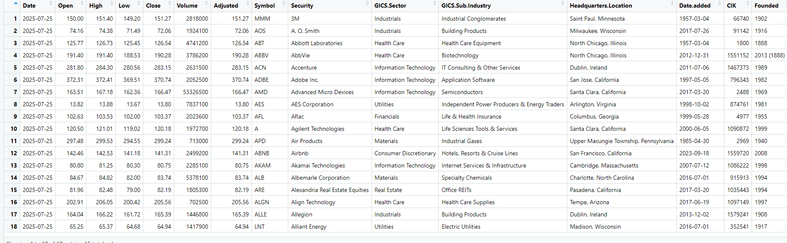

# 📈 S&P 500 Data Downloader

[](https://opensource.org/licenses/MIT)
[](https://github.com/Yigitbasi/s-and-p-500-data/issues)
[](https://www.r-project.org/)

> **S&P 500 Data Downloader** is the ultimate open-source tool for downloading, merging, and analyzing the latest daily stock data for all S&P 500 companies directly from Yahoo Finance. Ideal for data scientists, finance professionals, students, and developers looking for accurate, up-to-date, and ready-to-use market data with sector & industry context.

---

## ⭐ Why S&P 500 Data Downloader?

- **All-in-One**: Automate the download of daily prices (Open, High, Low, Close, Volume, Adjusted Close) for every S&P 500 company, with robust error handling to ensure full coverage.
- **Enriched Data**: Output includes sector and industry information for each ticker, perfect for financial analysis and machine learning.
- **Effortless Output**: Get a single, clean CSV file with comprehensive, merged data.
- **Open Source & Extensible**: Built in R, easy to modify and integrate into your own analytics pipelines.
- **Community Driven**: Contributions, feedback, and feature requests are highly encouraged!

---

## 🚀 Features

- Download historical and current daily pricing for ~500 S&P 500 stocks.
- Robust error handling: skips symbols that fail, ensuring smooth batch runs.
- Automatic merging with latest sector & industry info.
- Designed for reproducible research and large-scale financial analysis.
- Generates a single CSV ready for data science, ML, or BI tools.

---

## 🖼️ Example Output

Below is a sample screenshot from the generated CSV dataset:


---

## SEO Keywords

S&P 500 stock data, historical S&P 500, Yahoo Finance downloader, free S&P 500 dataset, R financial data, S&P 500 CSV, stock market data API, machine learning stock data, open source finance, quantitative analysis, investment research, data science stocks, R script S&P 500, financial analytics, daily stock prices, sector industry data.

---

## 🛠️ Installation & Quick Start

### Prerequisites

- [R](https://cran.r-project.org/) and [RStudio](https://posit.co/download/rstudio-desktop/)

### Install

```sh
git clone https://github.com/Yigitbasi/s-and-p-500-data.git
cd s-and-p-500-data
```

Open `Low.R` in RStudio and install required R packages:

```r
install.packages(c("quantmod", "dplyr", "openxlsx"))
```

### Usage

1. Make sure `sp500_verileri.csv` (the list of S&P 500 tickers with sector info) is in your project folder.
2. Run the entire `Low.R` script in RStudio (`Ctrl+Shift+Enter`).
3. The script will download and merge all data, creating **`sp500_daily_data.csv`** in the directory.

---

## 💡 Use Cases

- Financial and quantitative research
- Building machine learning models with real stock data
- Portfolio analysis and backtesting
- Educational projects and tutorials
- Integrating S&P 500 data into dashboards and BI tools

---

## 🤝 Contribute & Community

We welcome pull requests, issues, and feature ideas!  
Help us make the best open-source S&P 500 data tool on GitHub.

**How to contribute:**

1. Fork the repo
2. Create your branch (`git checkout -b feature/NewFeature`)
3. Commit your changes (`git commit -m 'Add new feature'`)
4. Push to your branch (`git push origin feature/NewFeature`)
5. [Open a pull request](https://github.com/Yigitbasi/s-and-p-500-data/pulls)

See [CONTRIBUTING.md](CONTRIBUTING.md) for more details.

---

## 📷 How to Add Your Own Screenshot

1. Take a screenshot of your dataset or analysis.
2. Put the image in the `images/` directory (e.g., `images/dataset_sample.png`).
3. Reference it in this README with:
   ```markdown
   
   ```

---

## 📝 License

Distributed under the MIT License. See [`LICENSE`](LICENSE) for more information.

---

## 📣 Contact

- [GitHub Issues](https://github.com/Yigitbasi/s-and-p-500-data/issues)
- [Your LinkedIn or Website] (optional)

---

### If you find this project useful, please ⭐ star the repo and share it!
